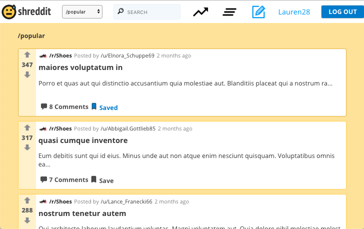
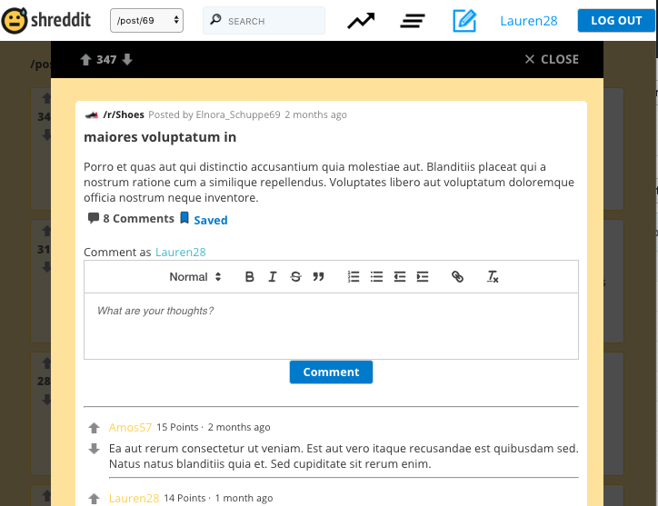
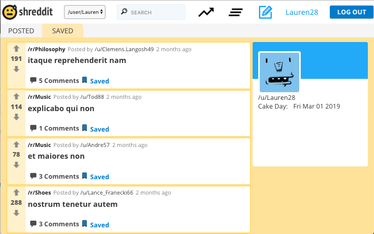
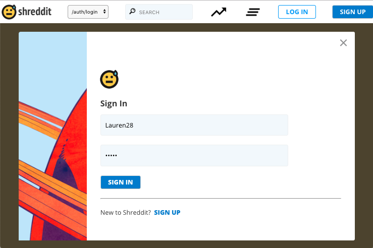

# Shreddit

Reddit gets you overwhelmed with content? Try Shreddit! a simplified, shredded-down clone, which is all about quality discussions and solely verbal content - no images, no videos. Built using React, Redux including an API built with express and SQL.

### Main Features ###

In Shreddit, a user is able to securely sign up, view all posts sorted popularity, upvote and downvote posts and comments, create and save posts, comment and follow users.

Check out the [Docs](./Docs) for more information such as MVP, wireframes, API_endpoints and a DB schema.

### Screenshots ###

### Local Installation ###

To install Shreddit locally, clone this repo, install npm packages in backend and front end folder `$ npm install`, and seed the database in `/backend/db` with the command `psql -f seed.sql` (you will need to have Postgres installed).
